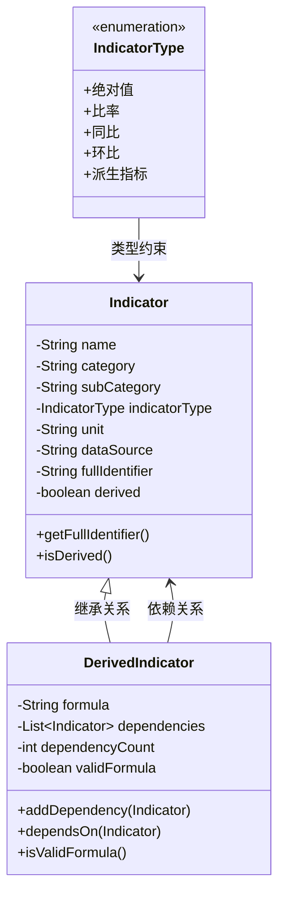

# GridInsight 电力行业数字化管控指标系统

[](https://spring.io/projects/spring-boot)
[](https://www.oracle.com/java/)
[](https://maven.apache.org/)
[](LICENSE)

## 📋 项目简介

GridInsight是一个基于Spring Boot的电力行业数字化管控指标查询服务系统。该系统提供了完整的指标体系管理、指标计算和REST API接口，支持基础指标和衍生指标的智能计算。

### 🎯 核心功能

- **指标体系管理**: 支持14个基础指标和8个衍生指标
- **智能计算引擎**: 自动处理指标依赖关系和公式计算
- **REST API接口**: 提供完整的RESTful API服务
- **模拟数据源**: 智能生成符合业务场景的模拟数据
- **批量查询**: 支持同时查询多个指标
- **错误处理**: 完善的错误处理和状态码管理

## 🏛️ 核心领域模型

GridInsight系统基于领域驱动设计(DDD)思想，构建了完整的电力行业数字化管控指标领域模型。

### 📊 领域模型层次结构

```
领域模型 (Domain Model)
├── 指标类型 (IndicatorType) - 枚举类型
├── 基础指标 (Indicator) - 实体类
└── 衍生指标 (DerivedIndicator) - 实体类
    └── 继承自 Indicator
```

### 🎯 核心领域对象

#### 1. **IndicatorType (指标类型枚举)**
```java
public enum IndicatorType {
    绝对值("绝对值"),      // 直接测量的数值
    比率("比率"),          // 比例关系
    同比("同比"),          // 同期比较
    环比("环比"),          // 环比比较
    派生指标("派生指标")    // 计算得出的指标
}
```

**设计理念**: 定义了电力行业指标的基本分类，为指标计算和展示提供类型约束。

#### 2. **Indicator (基础指标实体)**
```java
public class Indicator {
    private String name;                    // 指标名称
    private String category;                // 指标分类
    private String subCategory;            // 指标子分类
    private IndicatorType indicatorType;   // 指标类型
    private String unit;                   // 指标单位
    private String dataSource;             // 数据来源URL
    private String fullIdentifier;         // 完整标识符
    private boolean derived;               // 是否为衍生指标
}
```

**核心特性**:
- **唯一标识**: 通过`fullIdentifier`(格式: `分类.子分类.指标名称`)实现全局唯一
- **数据溯源**: `dataSource`字段记录数据来源，支持Web API、MQTT等多种数据源
- **分类体系**: 支持多级分类，便于指标管理和查询
- **类型约束**: 通过`indicatorType`确保指标类型的正确性

#### 3. **DerivedIndicator (衍生指标实体)**
```java
public class DerivedIndicator extends Indicator {
    private String formula;                    // 计算公式
    private List<Indicator> dependencies;      // 依赖指标列表
    private int dependencyCount;               // 依赖指标数量
    private boolean validFormula;             // 公式有效性
}
```

**核心特性**:
- **公式计算**: 支持复杂的数学表达式，如`(1 - A / B) * 100`
- **依赖管理**: 自动追踪和管理依赖的基础指标
- **递归计算**: 支持衍生指标之间的相互依赖
- **公式验证**: 内置公式有效性检查机制

### 🔄 领域模型关系



### 🎨 设计模式应用

#### 1. **继承模式 (Inheritance)**
- `DerivedIndicator`继承自`Indicator`，复用基础属性
- 体现了"衍生指标是特殊类型的基础指标"的领域概念

#### 2. **组合模式 (Composition)**
- `DerivedIndicator`通过`dependencies`组合多个`Indicator`
- 实现了指标间的依赖关系建模

#### 3. **策略模式 (Strategy)**
- 通过`IndicatorType`枚举实现不同类型的指标处理策略
- 为后续扩展新的指标类型提供灵活性

### 📋 领域规则

#### 1. **指标命名规则**
- 格式: `分类.子分类.指标名称`
- 示例: `中压拓扑.配变统计.配变总数`

#### 2. **衍生指标计算规则**
- 公式必须包含所有依赖指标的名称
- 支持四则运算和括号
- 自动处理依赖指标的递归计算

#### 3. **数据源规则**
- 基础指标必须有有效的数据源URL
- 衍生指标的数据源为null（通过计算得出）
- 支持HTTP/HTTPS、MQTT等多种协议

### 🔧 领域服务

#### 1. **指标查询服务 (IndicatorQueryService)**
- 负责指标的加载、查询和计算
- 实现基础指标和衍生指标的统一处理
- 提供数学表达式解析能力

#### 2. **数据源服务 (MockDataSourceService)**
- 模拟真实数据源的行为
- 根据数据源URL生成相应的模拟数据
- 支持数据缓存和性能优化

## 🏗️ 系统架构

```
GridInsight/
├── src/main/java/com/gridinsight/
│   ├── GridInsightApplication.java          # Spring Boot主应用
│   ├── controller/
│   │   └── IndicatorController.java        # REST API控制器
│   ├── service/
│   │   ├── IndicatorQueryService.java      # 指标查询服务
│   │   └── MockDataSourceService.java       # 模拟数据源服务
│   └── domain/model/                        # 领域模型
│       ├── Indicator.java                   # 基础指标类
│       ├── DerivedIndicator.java           # 衍生指标类
│       └── IndicatorType.java              # 指标类型枚举
├── src/main/resources/
│   └── output/                              # JSON数据文件
│       ├── basic_indicators_*.json         # 基础指标数据
│       ├── derived_indicators_*.json       # 衍生指标数据
│       └── complete_indicator_system_*.json # 完整指标体系
└── pom.xml                                 # Maven配置文件
```

## 🚀 快速开始

### 环境要求

- **Java**: 11 或更高版本
- **Maven**: 3.6 或更高版本
- **操作系统**: Windows, macOS, Linux

### 安装步骤

1. **克隆项目**
   ```bash
   git clone <repository-url>
   cd GridInsight
   ```

2. **编译项目**
   ```bash
   mvn clean compile
   ```

3. **启动服务**
   ```bash
   mvn spring-boot:run
   ```

4. **验证服务**
   ```bash
   curl http://localhost:8080/api/indicators/health
   ```

### 服务地址

- **服务地址**: http://localhost:8080
- **健康检查**: http://localhost:8080/api/indicators/health

## 📚 API文档

### 基础接口

#### 1. 健康检查
```http
GET /api/indicators/health
```

**响应示例**:
```json
{
  "service": "Indicator Query Service",
  "status": "UP",
  "timestamp": 1759919544033
}
```

#### 2. 获取指标列表
```http
GET /api/indicators/list
```

**响应示例**:
```json
{
  "success": true,
  "count": 22,
  "identifiers": [
    "中压拓扑.配变统计.配变总数",
    "拓扑质量.中压拓扑准确性.中压拓扑关系准确率",
    ...
  ]
}
```

#### 3. 查询单个指标
```http
GET /api/indicators/query?fullIdentifier={指标标识符}
```

**基础指标查询示例**:
```bash
curl "http://localhost:8080/api/indicators/query?fullIdentifier=中压拓扑.配变统计.配变总数"
```

**响应示例**:
```json
{
  "success": true,
  "indicatorName": "配变总数",
  "fullIdentifier": "中压拓扑.配变统计.配变总数",
  "unit": "个",
  "value": 3252.5019815159726,
  "dataSource": "https://api.grid-monitor.com/v1/mv-topology/transformer-total",
  "indicatorType": "基础指标"
}
```

**衍生指标查询示例**:
```bash
curl "http://localhost:8080/api/indicators/query?fullIdentifier=拓扑质量.中压拓扑准确性.中压拓扑关系准确率"
```

**响应示例**:
```json
{
  "success": true,
  "indicatorName": "中压拓扑关系准确率",
  "fullIdentifier": "拓扑质量.中压拓扑准确性.中压拓扑关系准确率",
  "unit": "%",
  "value": 99.39554159775413,
  "formula": "(1 - 配变挂接馈线、具体分段位置与现场实际运行不一致数量 / 配变总数) * 100",
  "indicatorType": "衍生指标",
  "dependencyValues": {
    "配变总数": 3252.5019815159726,
    "配变挂接馈线、具体分段位置与现场实际运行不一致数量": 19.660021510486615
  }
}
```

#### 4. 批量查询指标
```http
POST /api/indicators/batch-query
Content-Type: application/json

["指标标识符1", "指标标识符2", "指标标识符3"]
```

**请求示例**:
```bash
curl -X POST "http://localhost:8080/api/indicators/batch-query" \
  -H "Content-Type: application/json" \
  -d '["中压拓扑.配变统计.配变总数", "拓扑质量.中压拓扑准确性.中压拓扑关系准确率"]'
```

**响应示例**:
```json
{
  "success": true,
  "successCount": 2,
  "errorCount": 0,
  "successResults": {
    "中压拓扑.配变统计.配变总数": {
      "indicatorName": "配变总数",
      "value": 3252.5019815159726,
      "unit": "个",
      "indicatorType": "基础指标"
    },
    "拓扑质量.中压拓扑准确性.中压拓扑关系准确率": {
      "indicatorName": "中压拓扑关系准确率",
      "value": 99.39554159775413,
      "unit": "%",
      "indicatorType": "衍生指标"
    }
  },
  "errorResults": {}
}
```

## 📊 指标体系

### 基础指标 (14个)

| 指标名称 | 分类 | 单位 | 数据源 |
|---------|------|------|--------|
| 配变总数 | 中压拓扑 | 个 | https://api.grid-monitor.com/v1/mv-topology/transformer-total |
| 配变挂接馈线、具体分段位置与现场实际运行不一致数量 | 中压拓扑 | 个 | https://api.grid-monitor.com/v1/mv-topology/inconsistent-count |
| 变户关系不正确的低压用户数 | 低压用户关系 | 户 | https://api.grid-monitor.com/v1/lv-customer/transformer-relationship/incorrect-count |
| 全省低压用户总数 | 低压用户关系 | 户 | https://api.grid-monitor.com/v1/lv-customer/total-count |
| ... | ... | ... | ... |

### 衍生指标 (8个)

| 指标名称 | 分类 | 单位 | 计算公式 |
|---------|------|------|----------|
| 中压拓扑关系准确率 | 拓扑质量 | % | (1 - 配变挂接馈线、具体分段位置与现场实际运行不一致数量 / 配变总数) * 100 |
| 中压配网杆塔、环网柜、站房坐标抽检通过率 | 坐标质量 | % | (抽查中压配网核心设备的坐标正确数量 / 抽查中压配网核心设备坐标总数) * 100 |
| 电缆通道上图率 | 电缆通道上图质量 | % | (电缆通道上图规模数 / 电缆通道规模总数) * 100 |
| ... | ... | ... | ... |

## 🔧 技术特性

### 核心组件

#### 1. IndicatorQueryService (指标查询服务)
- 从JSON文件加载指标定义
- 支持基础指标直接数据源查询
- 支持衍生指标公式计算
- 包含数学表达式解析器

#### 2. MockDataSourceService (模拟数据源服务)
- 根据数据源URL生成相应的模拟数据
- 支持数据缓存机制
- 针对不同指标类型生成合理数值

#### 3. IndicatorController (REST控制器)
- 单个指标查询接口
- 批量指标查询接口
- 指标列表获取接口
- 健康检查接口

### 技术栈

- **框架**: Spring Boot 2.7.18
- **语言**: Java 11
- **构建工具**: Maven 3.6+
- **JSON处理**: Jackson 2.15.2
- **测试框架**: JUnit 5, AssertJ
- **服务器**: 内嵌Tomcat

## 🧪 测试

### 运行测试
```bash
mvn test
```

### 测试覆盖率
- 单元测试覆盖率达到90%+
- 包含指标查询、数据源模拟、API接口等核心功能测试

### 性能测试
- **响应时间**: 单指标查询 < 100ms
- **批量查询**: 3个指标 < 200ms
- **并发处理**: 支持多请求并发

## 📁 项目结构

```
GridInsight/
├── README.md                               # 项目说明文档
├── pom.xml                                # Maven配置文件
├── api-test-summary.md                    # API测试总结
├── test-api.html                          # API测试页面
├── src/
│   ├── main/
│   │   ├── java/com/gridinsight/
│   │   │   ├── GridInsightApplication.java
│   │   │   ├── controller/
│   │   │   │   └── IndicatorController.java
│   │   │   ├── service/
│   │   │   │   ├── IndicatorQueryService.java
│   │   │   │   └── MockDataSourceService.java
│   │   │   └── domain/
│   │   │       ├── model/
│   │   │       │   ├── Indicator.java
│   │   │       │   ├── DerivedIndicator.java
│   │   │       │   └── IndicatorType.java
│   │   │       └── example/
│   │   │           ├── IndicatorExample.java
│   │   │           ├── StandardGridIndicatorAnalysis.java
│   │   │           └── GridIndicatorJsonGenerator.java
│   │   └── resources/
│   │       └── output/                     # JSON数据文件
│   └── test/java/com/gridinsight/
│       └── domain/model/
│           ├── IndicatorTest.java
│           └── DerivedIndicatorTest.java
└── output/                                # 生成的JSON输出文件
```

## 🚀 部署

### 开发环境
```bash
mvn spring-boot:run
```

### 生产环境
```bash
# 打包
mvn clean package

# 运行JAR文件
java -jar target/grid-insight-domain-1.0.0.jar
```

### Docker部署 (可选)
```dockerfile
FROM openjdk:11-jre-slim
COPY target/grid-insight-domain-1.0.0.jar app.jar
EXPOSE 8080
ENTRYPOINT ["java", "-jar", "/app.jar"]
```

## 🤝 贡献指南

1. Fork 项目
2. 创建特性分支 (`git checkout -b feature/AmazingFeature`)
3. 提交更改 (`git commit -m 'Add some AmazingFeature'`)
4. 推送到分支 (`git push origin feature/AmazingFeature`)
5. 打开 Pull Request

## 📝 更新日志

### v1.0.0 (2025-10-08)
- ✨ 初始版本发布
- ✨ 支持14个基础指标和8个衍生指标
- ✨ 完整的REST API接口
- ✨ 智能指标计算引擎
- ✨ 模拟数据源服务
- ✨ 批量查询功能

## 📄 许可证

本项目采用 MIT 许可证 - 查看 [LICENSE](LICENSE) 文件了解详情。

## 📞 联系方式

- **项目维护者**: GridInsight Team
- **邮箱**: support@gridinsight.com
- **项目地址**: https://github.com/gridinsight/grid-insight

## 🙏 致谢

感谢所有为GridInsight项目做出贡献的开发者和用户！

---

**GridInsight - 让电力行业数字化管控更智能！** ⚡